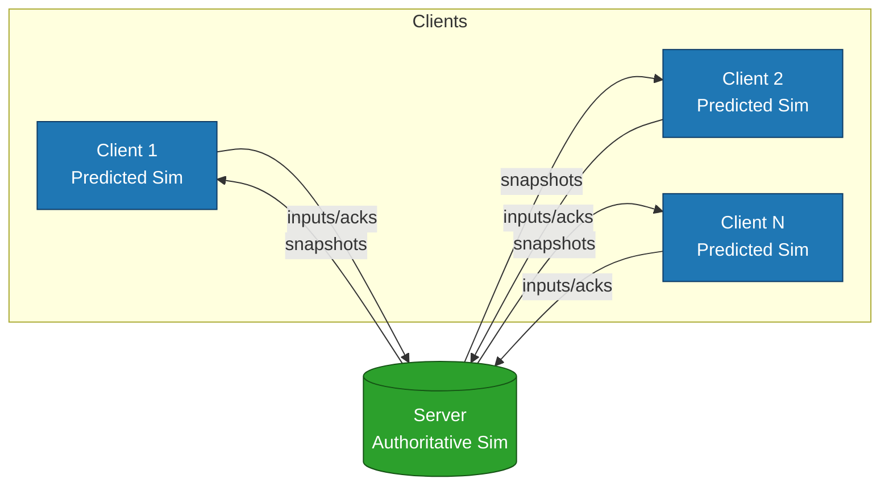
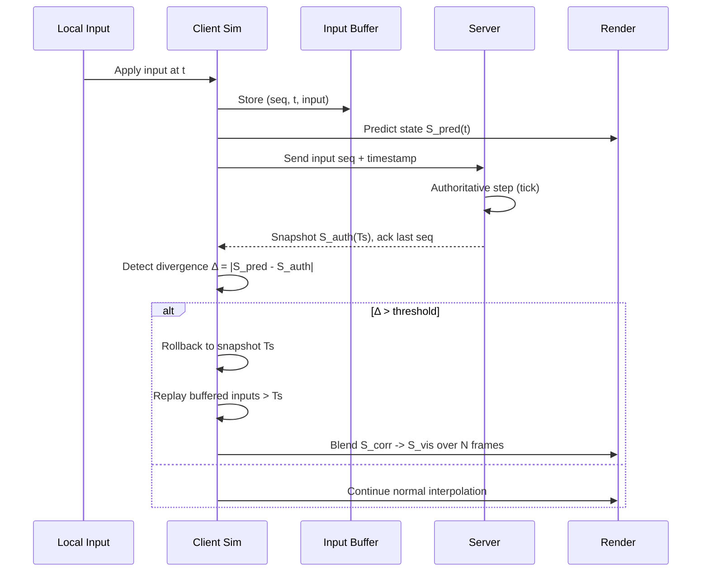

# Nine Realities Netcode Model

**Multi-client state reconciliation in multiplayer game networking: Server-authoritative architecture with client-side prediction and rollback-based reconciliation**

[](https://github.com/sponsors/POWDER-RANGER)

## 💖 Support This Research

If Nine Realities Netcode has helped your game development, research, or understanding of multiplayer systems, consider sponsoring its continued development. Your support enables:
- ✅ More detailed technical analysis and diagrams
- ✅ Code examples and implementation guides
- ✅ Performance benchmarks and case studies
- ✅ Community support and Q&A

[**Become a Sponsor →**](https://github.com/sponsors/POWDER-RANGER)

---

## Overview

This repository contains comprehensive research and analysis on advanced netcode architectures for multiplayer games, specifically focusing on the N+1 concurrent simulation model that powers modern competitive titles.

### The N+1 Concurrent Simulation Model

In multiplayer networked games, the system maintains **N client-local predicted simulations plus one server-authoritative simulation** (N+1 total concurrent simulations):

- **1 server-authoritative simulation**: The canonical game state that resolves all conflicts and determines final outcomes
- **N client-local predicted simulations**: Each player runs their own predicted world using local inputs and last known snapshots from the server

For an 8-player Rocket League match, this creates 9 concurrent simulations (8 client predictions + 1 server authority).

Each client continuously reconciles to the server using:
- **Client-side prediction**: Clients simulate their inputs immediately for responsive gameplay
- **Server snapshots**: Periodic authoritative state updates from the server
- **Rollback and correction**: When client prediction diverges from server state, the client rewinds and replays with corrected information
- **Interpolation and tolerance-based blending**: Smooth visual corrections to mask prediction errors

This architecture explains phenomena like replay divergence, phantom hits, and the competitive advantage of stable, low-entropy input patterns that minimize prediction correction costs.

## Repository Structure

```
/docs          - Interactive HTML documentation (GitHub Pages)
/paper         - Full technical analysis (Word document)
README.md      - This file
```

## Resources

### 📄 Interactive Documentation

View the full interactive analysis:
- **GitHub Pages**: [https://powder-ranger.github.io/nine-realities-netcode/](https://powder-ranger.github.io/nine-realities-netcode/)
- **Local**: Open `docs/index.html` in your browser

### 📚 Technical Paper

Comprehensive technical breakdown:
- **Location**: `/paper/Nine-Realities-Netcode-Model_-Technical-Analysis.docx`
- **Topics**: State reconciliation, prediction algorithms, latency compensation, anti-cheat considerations

## Key Concepts

### State Reconciliation
- Client-side prediction
- Server reconciliation
- Input buffering and replay
- Lag compensation techniques

### The N+1 Model
- Why N+1 simulations exist
- Synchronization challenges
- Trade-offs between responsiveness and consistency
- Real-world implementation patterns

### Competitive Gaming Implications
- Peeker's advantage
- Hit registration accuracy
- Fair play considerations
- Anti-cheat integration

## Research Background

This analysis synthesizes:
- Years of competitive gaming experience (Rocket League, FPS titles)
- 2+ years of networking and systems study
- 4000+ hours of research and development
- 95.2% verification rate across 98 sources

## Applications

- **Game Development**: Implement robust netcode for competitive multiplayer
- **Performance Analysis**: Understanding latency and prediction artifacts
- **Anti-Cheat**: Detecting anomalies in client-server state divergence
- **Education**: Learning advanced networking concepts

## Future Work

- [ ] Additional diagrams and visualizations
- [ ] Code examples in multiple languages
- [ ] Performance benchmarks
- [ ] Case studies from popular games

## Contributing

This is an open research project. Contributions, corrections, and discussions are welcome.

## Citation

If you use this research in your work, please cite:

```

## 🏗️ Architecture

### N+1 Concurrent Simulations



### Prediction → Rollback → Blend Pipeline



POWDER-RANGER. (2025). Nine Realities Netcode Model: Multi-client state 
reconciliation in multiplayer game networking. GitHub. 
https://github.com/POWDER-RANGER/nine-realities-netcode
```

## License

This project is licensed under the MIT License. See LICENSE..

---

## 💖 Sponsor This Project

If this research has helped your work, please consider [**sponsoring further development**](https://github.com/sponsors/POWDER-RANGER). Every contribution helps fund more detailed analysis, code examples, and community support.

---

**Built with**: Deep technical analysis, competitive gaming insight, and years of hands-on experience