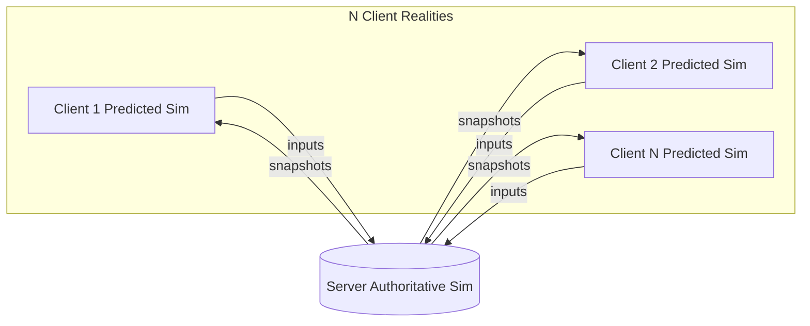
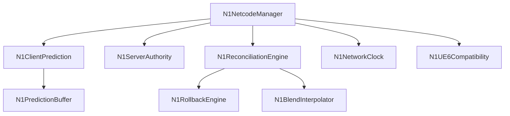

# Nine Realities Netcode Model v3.0

[](https://choosealicense.com/licenses/mit/)
[](https://github.com/POWDER-RANGER/nine-realities-netcode)
[](https://github.com/POWDER-RANGER/nine-realities-netcode/tree/unreal-9-reality-netcode-n1/NineRealitiesNetcode)
[](CHANGELOG.md)
[](https://powder-ranger.github.io/nine-realities-netcode/)

**Production-ready N+1 concurrent simulation framework for competitive multiplayer netcode.**

> Unreal Engine 5.5+ plugin with forward compatibility for UE6. Server-authoritative architecture with client-side prediction, rollback-based reconciliation, and adaptive state synchronization.

---

## What's New in v3.0

### Unreal Engine Plugin

The N+1 model is now a **production-ready Unreal Engine plugin** with 15,000+ lines of C++:

| Component | Class | Purpose |
|-----------|-------|---------|
| **Manager** | `UN1NetcodeManager` | Central orchestrator — Standalone/Client/Server/ListenServer modes |
| **Prediction** | `UN1ClientPrediction` | 4-mode adaptive prediction (Conservative/Balanced/Aggressive/Adaptive) |
| **Authority** | `UN1ServerAuthority` | Authoritative sim with per-client adaptive snapshots & lag compensation |
| **Rollback** | `UN1RollbackEngine` | Rollback+replay with cost estimation and depth limiting |
| **Blend** | `UN1BlendInterpolator` | 4-curve smoothing (Linear/SmoothStep/Exponential/CriticalDamping) |
| **Clock** | `UN1NetworkClock` | Cristian's algorithm with jitter buffering |
| **Buffer** | `UN1PredictionBuffer` | Ring buffer for rollback replay with contiguous validation |
| **Reconcile** | `UN1ReconciliationEngine` | 4-strategy reconciliation (Full/Adaptive/Delta/Interpolation) |

### UE6 Forward Compatibility

- **Runtime engine detection** — auto-adapts to UE5.5+ and future UE6
- **Network Snapshots V2** prepared for UE6 serialization format
- **QUIC transport ready** with UDP fallback
- **NetworkPrediction plugin** integration hooks

### Modernized Documentation Site

The [GitHub Pages site](https://powder-ranger.github.io/nine-realities-netcode/) has been completely redesigned with:
- New Plugin tab with installation and quick-start guides
- UE6 Ready tab with compatibility matrix and migration path
- Enhanced interactive simulations
- Responsive card-based design

---

## Quick Start

### Plugin Installation

```bash
# Copy the plugin into your UE project's Plugins folder
cp -r NineRealitiesNetcode /YourProject/Plugins/

# Rebuild your project — the plugin auto-registers
```

### C++ Quick Start

```cpp
#include "Core/N1NetcodeManager.h"

// Create and configure
auto* N1 = UN1NetcodeManager::GetN1Manager(GetWorld());
FN1NetcodeConfig Config;
Config.ClientTickRate = 120;
Config.ServerTickRate = 120;
Config.bAdaptivePrediction = true;
N1->Initialize(Config, EN1NetcodeMode::Server);
```

### Blueprint Quick Start

1. Search **"N1 Netcode Manager"** in the Blueprint editor
2. Call **Initialize** with your `FN1NetcodeConfig`
3. Bind to **OnPhaseChanged** and **OnDivergenceDetected** events
4. Read **FN1SimulationMetrics** for real-time performance data

---

## The N+1 Model

In any networked game with **N players and 1 server**, there exist **N+1 concurrent but divergent simulations** of the same game state:

- **N client realities**: Each player runs local prediction for responsive gameplay
- **+1 server reality**: The authoritative simulation that validates fairness

The "truth" emerges through continuous **reconciliation** between these competing realities.

### Pipeline: Prediction → Rollback → Blend

```
Local Input → Client Prediction → Render
                     ↓
              Server Snapshot
                     ↓
         Detect Divergence
                     ↓
    [Within Threshold] → Continue
    [Exceeds Threshold] → Rollback → Replay Inputs → Blend → Render
```

---

## Repository Structure

```
NineRealitiesNetcode/           # UE Plugin (NEW in v3.0)
├── NineRealitiesNetcode.uplugin
├── Source/
│   ├── NineRealitiesNetcode/        # Runtime module
│   │   ├── Public/
│   │   │   ├── Core/                # Manager, State, Clock, Buffer
│   │   │   ├── Pipeline/            # Prediction, Authority, Rollback, Blend, Reconcile
│   │   │   └── UE6/                 # Forward compatibility layer
│   │   └── Private/                 # Implementation files
│   └── NineRealitiesNetcodeEditor/  # Editor module
├── docs/                        # GitHub Pages site
├── examples/                    # Pseudocode and JS examples
├── paper/                       # Technical analysis (DOCX)
├── PERFORMANCE.md               # Benchmarks and analysis
├── ROADMAP.md                   # Future plans
└── CHANGELOG.md                 # Version history
```

---

## Architecture

### N+1 Concurrent Simulations


```mermaid
flowchart LR
  subgraph Clients["N Client Realities"]
    C1[Client 1 Predicted Sim]
    C2[Client 2 Predicted Sim]
    Cn[Client N Predicted Sim]
  end
  S[(Server Authoritative Sim)]

  C1 -- inputs --> S
  C2 -- inputs --> S
  Cn -- inputs --> S
  S -- snapshots --> C1
  S -- snapshots --> C2
  S -- snapshots --> Cn
```

### Plugin Module Graph


```mermaid
flowchart TD
  A[N1NetcodeManager] --> B[N1ClientPrediction]
  A --> C[N1ServerAuthority]
  A --> D[N1ReconciliationEngine]
  A --> E[N1NetworkClock]
  B --> F[N1PredictionBuffer]
  D --> G[N1RollbackEngine]
  D --> H[N1BlendInterpolator]
  A --> I[N1UE6Compatibility]
```

---

## Documentation

- **Interactive Docs**: [powder-ranger.github.io/nine-realities-netcode](https://powder-ranger.github.io/nine-realities-netcode/)
- **Performance Benchmarks**: [PERFORMANCE.md](PERFORMANCE.md)
- **Technical Paper**: `/paper/Nine-Realities-Netcode-Model_-Technical-Analysis.docx`
- **Changelog**: [CHANGELOG.md](CHANGELOG.md)
- **Roadmap**: [ROADMAP.md](ROADMAP.md)

---

## UE6 Migration Path

| Feature | UE5.5 | UE6 |
|---------|-------|-----|
| Core Simulation | Custom implementation | Native NetworkPrediction integration |
| Serialization | FBitWriter + N1 extensions | FNetworkBitWriterV2 |
| Time Sync | Cristian's algorithm | NetworkTimeSubsystem |
| Transport | UDP | QUIC + UDP fallback |
| Congestion Control | Static | Pluggable (Cubic, BBR) |

**Migration steps** (when UE6 releases):
1. Update `EngineVersion` to `6.0.0` in `.uplugin`
2. Enable `N1_UE6_BUILD` in build config
3. Compatibility layer auto-switches to native APIs

---

## Performance

| Metric | Value |
|--------|-------|
| Client prediction time | ~0.9ms/frame |
| Reconciliation time | ~0.6ms/frame |
| Rollback cost (8 frames) | ~2.3ms |
| Bandwidth (8 players, 60Hz) | ~142 kbps/client downstream |
| Memory (120-frame buffer) | ~192 KB per entity |
| Quantization precision | Position: 0.01u, Rotation: ~0.002 deg |

See [PERFORMANCE.md](PERFORMANCE.md) for full benchmarks.

---

## Contributing

See [CONTRIBUTING.md](CONTRIBUTING.md). This is open research — contributions, corrections, and discussions are welcome.

## License

MIT License. See [LICENSE](LICENSE).

---

**Built by**: POWDER-RANGER (Curtis Charles Farrar)  
**Version**: 3.0.0 | **Engine**: UE5.5+ / UE6 Ready  
**Site**: [powder-ranger.github.io/nine-realities-netcode](https://powder-ranger.github.io/nine-realities-netcode/)
